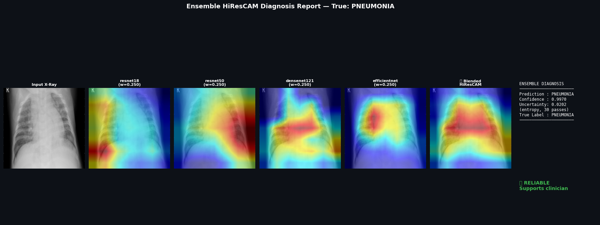
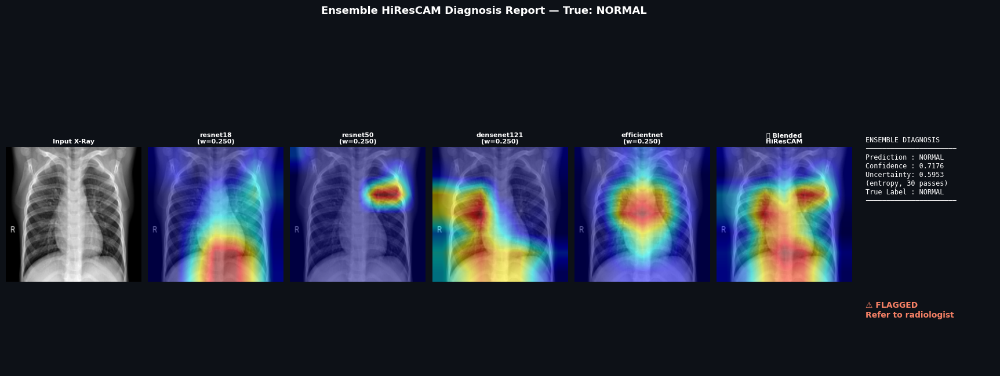
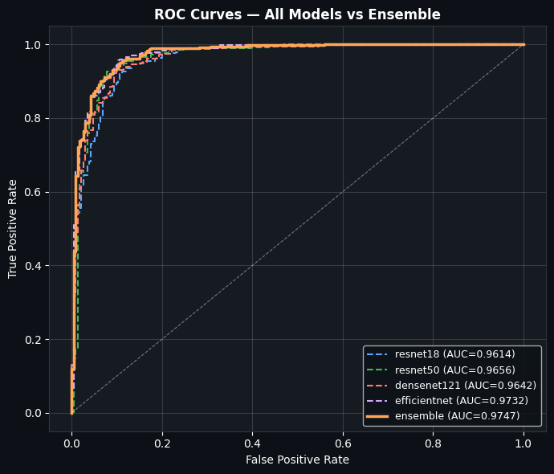
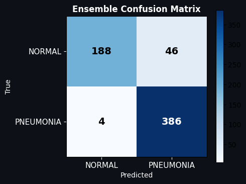

# 🫁 MedXAI

> Reliable Medical AI through Explainability and Uncertainty Quantification

An ensemble deep learning system for chest X-ray diagnosis that not only predicts disease, but also explains its reasoning and quantifies its confidence.

---

## Why This Matters

Most medical AI systems output only a prediction.

They cannot answer:

- Why was this prediction made?
- How confident is the model?
- Should a clinician trust the result?

MedXAI addresses these questions using:

- 🧠 Ensemble CNNs
- 🔍 HiResCAM Explainability
- 📊 Monte Carlo Dropout Uncertainty Estimation
- 🚦 Reliability-Based Decision Support

---

## Key Features

- Chest X-ray classification (NORMAL vs PNEUMONIA)
- Ensemble of ResNet18, ResNet50, DenseNet121 and EfficientNet-B0
- HiResCAM visual explanations
- Monte Carlo Dropout uncertainty estimation
- Automatic flagging of unreliable predictions
- Human-in-the-loop clinical support workflow

---

## System Architecture

```text
Chest X-Ray
     │
     ▼
Preprocessing
     │
     ▼
CNN Ensemble
     │
     ├── ResNet18
     ├── ResNet50
     ├── DenseNet121
     └── EfficientNet-B0
     │
     ▼
MC Dropout
(T = 30 passes)
     │
     ▼
Prediction Distribution
     │
     ├── Uncertainty Estimation
     └── HiResCAM Explanation
     │
     ▼
Decision Engine
```

---

## Example Diagnosis — Pneumonia



The model predicts **PNEUMONIA** with high confidence and low uncertainty. The prediction is marked as reliable and supported by ensemble HiResCAM explanations.

---

## Example Diagnosis — Normal



The model predicts **NORMAL**, but uncertainty exceeds the safety threshold. The case is automatically flagged for expert review.

---

## Performance

| Model | Accuracy | Precision | Recall | F1 |
|---------|---------|---------|---------|---------|
| ResNet18 | 90.2% | 87.6% | 98.2% | 92.6% |
| ResNet50 | 84.3% | 80.3% | 99.2% | 88.8% |
| DenseNet121 | 90.2% | 87.6% | 98.2% | 92.6% |
| EfficientNet-B0 | 92.1% | 90.3% | 97.9% | 94.0% |
| Ensemble | 92.0% | 89.4% | 99.0% | 93.9% |

---

## ROC Curve



The ensemble achieves the highest overall discrimination performance among all evaluated models.

---

## Ensemble Confusion Matrix



Key observation:

- Only **4 false negatives**
- High pneumonia sensitivity
- Suitable for risk-sensitive medical screening

---

## Repository Structure

```text
Medical-AI-Diagnosis/
│
├── models/
├── uncertainty/
├── explainability/
├── ensemble/
├── app/
├── results/
└── README.md
```

---

## Technology Stack

### Deep Learning

- PyTorch
- Torchvision

### Explainability

- HiResCAM
- Grad-CAM

### Uncertainty Quantification

- Monte Carlo Dropout
- Predictive Entropy

### Data Science

- NumPy
- Pandas
- Scikit-Learn

### Visualization

- Matplotlib
- OpenCV

---

## Team

| Member | Contributions |
|----------|----------|
| Tanishka Pal | DenseNet-121 implementation, ensemble architecture, weighted voting ensemble pipeline, evaluation framework,  documentation |
| Trika Jaiswal | ResNet-18 implementation, MedXAI Vision UI, MC Dropout integration, uncertainty estimation, reliability analysis, documentation  |
| Tanush Kumar | ResNet-50 training and experimentation |
| Shubhankar Bhan | EfficientNet-B0 training and experimentation |

### Faculty Mentors

- Dr. Priyanka Deshmukh
- Dr. Hema Karande

Guided by:

- Dr. Priyanka Deshmukh
- Dr. Hema Karande

Symbiosis Institute of Technology, Pune

---

## Research Contribution

MedXAI combines:

- Ensemble Learning
- Explainable AI
- Uncertainty Quantification

into a single clinical decision-support framework capable of identifying not only what it predicts, but also when it should defer to human expertise.
